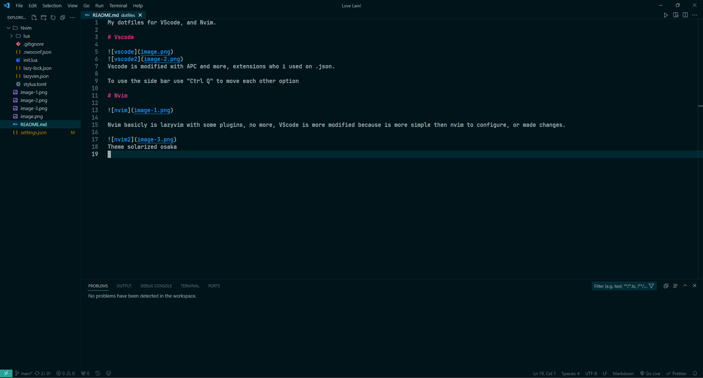
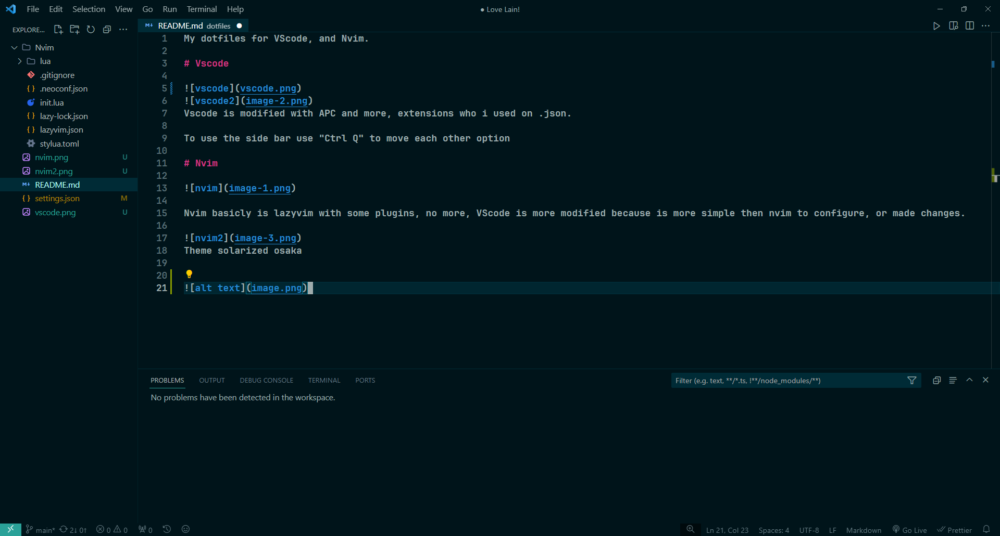

# My dotfiles for VScode, and Nvim.

# Vscode

Vscode is modified with APC and more, extensions who i used on .json.

To use the side bar use "Ctrl Q" to move each other option

# Nvim

Nvim basicly is lazyvim with some plugins, no more, VScode is more modified because is more simple then nvim to configure, or made changes.

Theme solarized osaka
